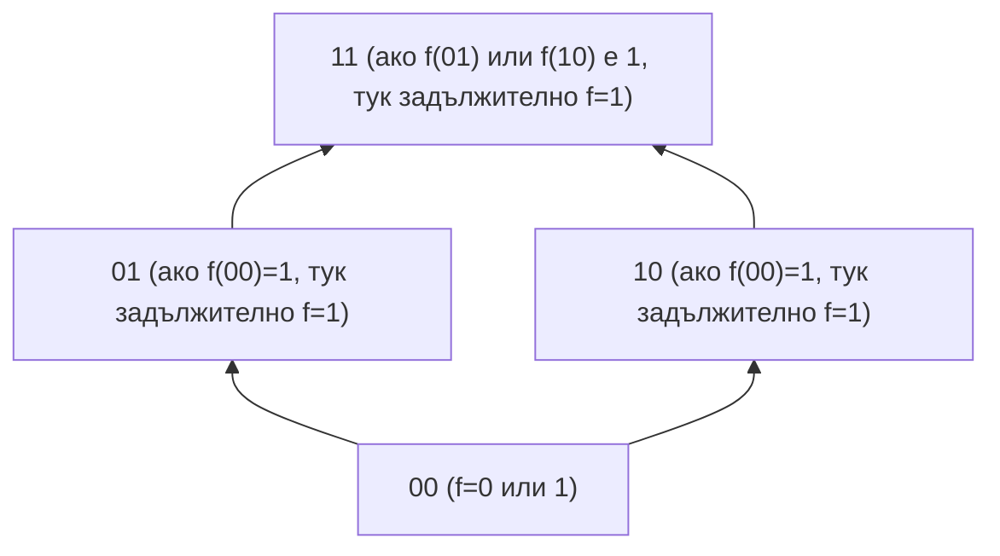

# Дискретни структури - контролно 2

## 1. Множества

---

## 2. Релации

---

## 3. Функции

---

## 4. Комбинаторика

### 4.1. Основни комбинаторни принципи

- **Принцип на Дирихле (Принцип на чекмеджетата)** - ако броят на елементите в едно множество е по-голям от този в друго, не е възможно да се дефинира инекция между тях.
    - $|A| > |B| \implies \nexists f: A \to B \text{ (инективна)}$

- **Принцип на биекцията** - две множества имат еднакъв брой елементи тогава и само тогава, когато съществува взаимно еднозначно съответствие между тях.
    - $|A| = |B| \iff \exists f: A \to B \text{ (биекция)}$

- **Принцип за събирането** - броят на елементите в обединението на две непресичащи се множества е равен на сумата от техните индивидуални мощности.
    - $A \cap B = \emptyset \implies |A \cup B| = |A| + |B|$

- **Принцип за изваждането** - броят на елементите в разликата между универсално множество и негово подмножество.
    - $A \subseteq U \implies |U \setminus A| = |U| - |A|$

- **Принцип за разбиването** - мощността на едно множество е сума от мощностите на елементите на неговото разбиване (фамилия от непресичащи се подмножества).
    - $A = \bigcup S_i \implies |A| = \sum_{i=1}^k |S_i|$

- **Принцип за обединението** - общият брой елементи в две пресичащи се множества се намира чрез изваждане на сечението им, за да не се броят дублираните елементи.
    - $|A \cup B| = |A| + |B| - |A \cap B|$

- **Принцип за включване и изключване** - обобщение на принципа за обединение за произволен брой крайни множества.
    - $|\bigcup_{i=1}^n A_i| = \sum |A_i| - \sum |A_i \cap A_j| + \dots + (-1)^{n-1} |A_1 \cap \dots \cap A_n|$

- **Принцип за умножението** - общият брой на вариантите при последователен независим избор е равен на произведението от броя варианти на всяка стъпка.
    - $|A_1 \times A_2 \times \dots \times A_k| = |A_1| \cdot |A_2| \cdot \dots \cdot |A_k|$

### 4.2. Основни комбинаторни конфигурации

- $А$ ще бъде множеството, от което ще избираме и $|A|=n$

- **С наредба и с повторение (Вариации с повторение)** - избор на наредена m-орка от $n$-те елемента
    - $K_{H,П}(A, m) = \{f | f:\{1, 2, \dots , m\} → A\text{ и f е произволна} \}$
    - $|K_{H,П}(A, m)| = A^m = n^m$

- **С наредба без повторение (Вариации без повторение)** - всяка променлива се избира точно веднъж, което съответства на инективна функция.
    - $K_{H}(A, m) = \{f | f:\{1, 2, \dots , m\} → A \text{ и f е инекция }\}$
    - $V_n^k = \frac{n!}{(n-m)!} = n(n-1)\dots(n-m+1)$

  - **Пермутации** - частен случай при който $m=n$
    - $K_{H}(A, n) = \{f | f:\{1, 2, \dots , n\} → A \text{ и f е биекция }\}$
    - $P_n = n!$

- **Без наредба и без повторение** - избор на $m$-елементно подмножество от $n$-елементно множество, при който наредбата на елементите няма значение.
    - $C_n^m = \binom{n}{m} = \frac{n!}{m!(n-m)!}$

  - **Свойство на симетрия** - изборът на $m$ елемента, които да влязат в подмножеството, е еквивалентен на избора на $n-m$ елемента, които да останат извън него.
      - $\binom{n}{m} = \binom{n}{n-m}$

  - **Свойство на Паскал** - рекурсивна зависимост, според която биномен коефициент се получава като сума от двата коефициента над него в триъгълника на Паскал.
      - $\binom{n}{m} = \binom{n-1}{m} + \binom{n-1}{m-1}$

  - **Бином на Нютон** - формула за разлагане на степен на двучлен, където коефициентите пред членовете са съответните комбинации.
      - $(x+y)^n = \sum_{m=0}^n \binom{n}{m} x^m y^{n-m}$

- **Без наредба и с повторение**

  - **Уравнение на звездичките и преградите** - модел за намиране на броя решения на линейно уравнение в цели числа, който съответства на избор без наредба, но с повторение.
      - $x_1 + x_2 + \dots + x_n = m$

  - **Решения в положителни числа** - брой начини за разпределяне на $m$ обекта в $n$ групи, като всяка група съдържа поне един обект.
      - $|(N \setminus \{0\})^n| = \binom{m-1}{n-1}$

  - **Решения в естествени числа (Комбинации с повторение)** - брой начини за разпределяне на $m$ обекта в $n$ групи, като се допускат и празни групи.
      - $\bar{C}_n^m = \binom{m+n-1}{n-1}$

- **Пермутации с повторение** - наредба на $n$ елемента, разделени в $k$ групи от еднакви (неотличими) обекти.
    - $P_n(n_1, n_2, \dots, n_k) = \frac{n!}{n_1! n_2! \dots n_k!}$

  - **Наредени разбивания** - броят на начините едно множество $A$ да се раздели на $k$ подмножества с фиксирани мощности $n_i$.
      - $\binom{n}{n_1, n_2, \dots, n_k} = \frac{n!}{n_1! n_2! \dots n_k!}$

  - **Мултиномиална теорема** - обобщение на бинома на Нютон за сума от $k$ члена.
      - $(x_1 + \dots + x_k)^n = \sum_{n_1+\dots+n_k=n} \binom{n}{n_1, \dots, n_k} x_1^{n_1} \dots x_k^{n_k}$

---

## 5. Графи

### 5.1. Основни понятия

- **Краен граф** - граф, при който множествата на върховете и ребрата са крайни.
  - $G = (V, E), \text{ където } |V| < \infty \land |E| < \infty$

- **Ориентиран мултиграф** - граф с насочени ребра, при който са позволени многократни ребра между два върха.
  - $G = (V, E, f_G), \text{ където } f_G: E \to V \times V$

- **Претеглен граф** - граф, при който всяко ребро има съпоставена числова стойност (тегло).
  - $G = (V, E, c), \text{ където } c: E \to \mathbb{R}$

- **Свързан граф** - неориентиран граф, в който за всяка двойка върхове съществува свързващ ги път.
  - $\forall u, v \in V \exists \text{ път } p \text{ между } u \text{ и } v$

- **Свързана компонента** - максимален по включване свързан подграф на даден граф.
  - $C \subseteq V \text{ е компонента } \iff \forall u, v \in C \exists \text{ път } p(u, v)$

- **Дърво** - свързан неориентиран граф, който не съдържа цикли.
  - $|E| = |V| - 1 \land G \text{ е свързан}$

### 5.2. Пътища и цикли

- **Маршрут**
  - Последователност от съседни върхове и свързващите ги ребра, позволяваща повторения.
  - $W = (v_0, e_1, v_1, \dots, e_k, v_k)$

- **Път**
  - Маршрут, в който не се повтаря нито един връх.
  - $W \text{ е път } \iff \forall i, j (i \neq j \Rightarrow v_i \neq v_j)$

- **Цикъл**
  - Затворен път, при който само началният и крайният връх съвпадат.
  - $v_0 = v_k \land \forall i, j \in \{0, \dots, k-1\} (i \neq j \Rightarrow v_i \neq v_j)$

- **Контур**
  - Затворен маршрут в ориентиран граф.
  - $v_0 = v_k \land \forall i (e_i \in E_{orientated})$

### 5.3. Обхождания (Ойлер и Хамилтон)

- **Ойлеров маршрут**
  - Маршрут, който преминава през всяко ребро на графа точно веднъж.
  - $\exists \text{ маршрут } W : \forall e \in E, e \text{ участва точно веднъж в } W$

- **Ойлеров цикъл**
  - Ойлеров маршрут, чийто край съвпада с неговото начало.
  - $G \text{ е Ойлеров} \iff \forall v \in V (d(v) \equiv 0 \pmod 2)$

- **Хамилтонов път**
  - Път, който посещава всеки връх на графа точно веднъж.
  - $\exists p = (v_0, \dots, v_{n-1}) : \bigcup \{v_i\} = V \land \forall i, j (i \neq j \Rightarrow v_i \neq v_j)$

- **Хамилтонов цикъл**
  - Хамилтонов път, който е затворен.
  - $\forall u, v \in V (\{u, v\} \notin E \Rightarrow d(u) + d(v) \ge |V|) \Rightarrow \text{съществува } H_{cycle}$

### 5.4. Алгоритми

- **Обхождане в ширина (BFS)** - Систематично обхождане на върховете на нива, намиращо минимални пътища по брой ребра.
  - $\forall v \in V \forall i \le l (dist(r, v) = i \iff v \in L_i)$

- **Обхождане в дълбочина (DFS)**
  - Алгоритъм, който прониква максимално дълбоко по клоните на графа преди връщане назад.
  - $\exists \text{ стек } S, t = top(S) \land \forall v \in adj(t) (v \notin visited \Rightarrow S.push(v))$

- **Алгоритъм на Крускал**
  - Алгоритъм за МПД чрез сортиране на ребрата и добавяне на тези, които не затварят цикъл.
  - $e_i \in E_{MST} \iff c(e_i) = \min(E \setminus E_{MST}) \land \text{ацикличност}$

- **Алгоритъм на Прим**
  - Алгоритъм за МПД чрез добавяне на най-евтиното ребро към текущо растящо дърво.
  - $e = \{u, v\} : u \in U, v \notin U \land c(e) = \min \{c(w, z) \mid w \in U, z \notin U\}$

- **Алгоритъм на Дейкстра**
  - Намиране на най-къси пътища от корен до всички върхове в граф с неотрицателни тегла.
  - $d[u] = \min(d[u], d[u_0] + c(u_0, u))$

---

## 6. Булеви функции

### 6.1. Дефиниция
- **Дискретна функция** - n-местна дискретна функция е всяко изображение от n-тата декартова степен на крайно множество $A$ към самото множество $A$.

  - Нека $|A| = m, n \in \mathbb{N}$
  - $f$ е дискретна функция $\iff f: A^n \to A$
  - Броят на всички $n$-местни дискретни функции в $A$ е: $m^{m^n}$

- **Булевите функции** са частен случай на дискретните функции, при които множеството $A$ е $\{0, 1\}$. Елементите на $\{0, 1\}^n$ се наричат булеви вектори.

  - $F_2^n = \{ f \mid f: \{0, 1\}^n \to \{0, 1\} \}$
  - $F_2 = \bigcup_{n=1}^{\infty} F_2^n$

- **Фиктивна променлива** е тази, от която НЕ зависи стойността на функцията
  - $ \forall x_1, \dots, x_{i-1}, x_{i+1}, \dots, x_n \in \{0, 1\}:$
  $f(x_1, \dots, 0, \dots, x_n) = f(x_1, \dots, 1, \dots, x_n)$

- **Съществена променлива** е тази, от която зависи стойността на функцията
  - $ \forall x_1, \dots, x_{i-1}, x_{i+1}, \dots, x_n \in \{0, 1\}:$
  $f(x_1, \dots, 0, \dots, x_n) \not= f(x_1, \dots, 1, \dots, x_n)$

- **Проектираща функция** е такава, която директно връща k-тия си аргумент
  - $I^n_k : \{0, 1\}^n \to \{0, 1\}$ е проектираща
  - $\forall (x_1, x_2, \dots, x_n) \in \{0, 1\}^n : I^n_k(x_1, x_2, \dots, x_n) = x_k$

- **Лексикографска наредба** - стандартна подредба на булевите вектори, съответстваща на тяхното двоично представяне като числа.

  - **Индуктивна дефиниция:**
    1. $n=1: (0, 1)$
    2. $n+1: (0\alpha_0, 0\alpha_1, \dots, 0\alpha_{2^n-1}, 1\alpha_0, 1\alpha_1, \dots, 1\alpha_{2^n-1})$

  - **Позиция на вектор:**
    - Векторът $a_{n-1}a_{n-2} \dots a_0$ се намира на позиция:
$$\sum_{i=0}^{n-1} a_i \cdot 2^i$$

### 6.2. Функции на една променлива (n=1)
| име | запис | функция | 0 | 1 |
|---|---|---|---|---|
| константна нула | **0** | $f(x)=0$ | 0 | 0 |
| идентитет | id | $f(x)=x$ | 0 | 1 |
| отрицание | not | $f(x)=x+1$ | 1 | 0 |
| константна единица | **1** | $f(x)=1$ | 1 | 1 |

### 6.3. Функции на две променливи (n=2)
| име | запис | функция | 00 | 01 | 10 | 11 |
|---|---|---|---|---|---|---|
| константна нула | **0** | $f(x)=0$ | 0 | 0 | 0 | 0 |
| константна единица | **1** | $f(x)=1$ | 1 | 1 | 1 | 1 |
| сума / $xor$ | $\oplus$ | $f(x,y)=x+y$ | 0 | 1 | 1 | 0 |
| еквиваленция | $\equiv$ | $f(x,y)=x+y+1$ | 1 | 0 | 0 | 1 |
| черта на Шефер | \| | $f(x,y)=xy+1$ | 0 | 0 | 0 | 1 |
| конюнкция / $and$ | $\land$ | $f(x,y)=xy+1$ | 1 | 1 | 1 | 0 |
| стрелка на Пиърс | $\downarrow$ | $f(x,y)=1+x+y+xy$ | 1 | 0 | 0 | 0 |
| дизюнкция / $or$ | $\lor$ | $f(x,y)=x+y+xy$ | 0 | 1 | 1 | 1 |
| импликация | $\Rightarrow$ | $f(x,y)=1+x+xy$ | 1 | 1 | 0 | 1 |
| проектираща $x_1$ | $I_1^2$ | $f(x,y)=x$ | 0 | 0 | 1 | 1 |
| проектираща $x_2$ | $I_2^2$ | $f(x,y)=y$ | 0 | 1 | 0 | 1 |

### 6.4. Закони на Булевата алгебра

1. **Комутативност:** $x \lor y = y \lor x$
2. **Асоциативност:** $(x \oplus y) \oplus z = x \oplus (y \oplus z)$
3. **Дистрибутивност:** $x(y \lor z) = xy \lor xz$
4. **Идемпотентност:** $xx = x, x \lor x = x$
5. **Де Морган:** $\overline{xy} = \bar{x} \lor \bar{y}$ и $\overline{x \lor y} = \bar{x}\bar{y}$

### 6.5. Суперпозиция и Затваряне

- **Суперпозиция** -  операция, при която една функция се "влага" като аргумент в друга функция.
  - $h(x_1, \dots, x_n) = f(g_1(x_1, \dots, x_n), \dots, g_k(x_1, \dots, x_n))$

- **Затваряне $[F]$** - най-малкото множество от функции, което съдържа $F$ и всички проекции, и е затворено спрямо операцията суперпозиция.
  1. $F \subseteq [F]$
  2. $F \subseteq G \implies [F] \subseteq [G]$
  3. $[[F]] = [F]$ (Идемпотентност на затварянето)

### 6.6. Пълни множества от булеви функции

- **Пълнота** - свойство на множество от функции, което позволява чрез тях да се изрази всяка възможна булева функция чрез суперпозиция.
    - $[F] = F_2$

- **Степенен запис** - кратък запис за променлива или нейното отрицание, който съвпада с операцията еквивалентност $x \leftrightarrow a$.
    - $x^a = \begin{cases} \bar{x}, & a = 0 \\ x, & a = 1 \end{cases} \implies b^a = 1 \iff b = a$

- **Лема** - конюнкция на крайни на брой различни променливи или техните отрицания.
    - $b_{1}^{a_1} b_{2}^{a_2} \dots b_{k}^{a_k}=1 \iff b_1=a_1 \land b_2=a_2 \dots b_k=a_k$

- **Разлагане на функция** - представяне на произволна булева функция чрез фиксиране на част от нейните променливи.
    - $f(x_1, \dots, x_n) = \bigvee_{a_1, \dots, a_i \in \{0,1\}} x_1^{a_1} \dots x_i^{a_i} \cdot f(a_1, \dots, a_i, x_{i+1}, \dots, x_n)$

- **Теорема на Бул** - твърдение, че всяка булева функция може да се представи чрез отрицание, конюнкция и дизюнкция.
    - $\{\bar{x}, xy, x \lor y\}$ е пълно множество $\implies [\{\bar{x}, xy, x \lor y\}] = F_2$

### 6.7. Полином на Жегалкин

- **Полином на Жегалкин** - представяне на булева функция като сума по модул 2 ($\oplus$) от конюнкции на различни променливи.
    - $P(x_1, \dots, x_n) = \bigoplus_{I \subseteq \{1,\dots,n\}} a_I \left( \prod_{i \in I} x_i \right)$

  - Всяка булева функция притежава **уникално** представяне под формата на полином на Жегалкин.
    - $\forall f \in F_2^n, \exists! P: P \equiv f$

### 6.8. Съвършени форми

- **СКНФ (Съвършена конюнктивна нормална форма)** - представяне на функция $f \neq e_1$ като конюнкция от елементарни дизюнкции, съответстващи на нулевите стойности на функцията.
    - $f(x_1, \dots, x_n) = \bigwedge_{f(b_1, \dots, b_n)=0} (x_1^{b_1} \lor x_2^{b_2} \lor \dots \lor x_n^{b_n})$
- **СДНФ (Съвършена дизюнктивна нормална форма)** - представяне на функция $f \neq e_0$ като дизюнкция от елементарни конюнкции, съответстващи на единичните стойности на функцията.
    - $f(x_1, \dots, x_n) = \bigvee_{f(a_1, \dots, a_n)=1} x_1^{a_1} x_2^{a_2} \dots x_n^{a_n}$

### 6.9. Затворени множества

- **Затворено множество** - множество от функции, което съдържа всички функции, които могат да бъдат получени от него чрез суперпозиция.
    - $[F] = F$
    - **Критерий за затвореност**
      1. $\{I_k^n\} \subseteq F $
      2. $\forall f, g_1, \dots, g_k \in F \implies f(g_1, \dots, g_k) \in F$

- **Запазващи нулата/единицата** - класове функции, които върху изцяло нулеви (или единични) входни вектори дават съответната константа.
    - $T_0 = \{f \mid f(0, \dots, 0) = 0\}$
    - $T_1 = \{f \mid f(1, \dots, 1) = 1\}$

### 6.10. (Само)двойнствени функции

- **Двойнствена функция** - функция $f^\star$, чиито стойности са инвертирани спрямо $f$ върху противоположните вектори.
    - $f^\star(x_1, \dots, x_n) = \overline{f(\bar{x}_1, \dots, \bar{x}_n)}$

- **Принцип за двойнственост** - операцията за намиране на двойнствена функция е дистрибутивна спрямо суперпозицията.
    - $h = f(g_1, \dots, g_k) \implies h^\star = f^\star(g_1^\star, \dots, g_k^\star)$

- **Самодвойнственост** - свойство на функция, при което тя съвпада със своята двойнствена функция.
    - $f \in S \iff f = f^\star \iff f(x_1, \dots, x_n) = \overline{f(\bar{x}_1, \dots, \bar{x}_n)}$

    - $f \in S \iff \forall \alpha \in \{0, 1\}^n: f(\alpha) \neq f(\bar{\alpha})$

- **Брой на самодвойнствените функции** - броят им се определя от свободата за избор на стойности само върху едната половина от вектора на функцията.
    - $|S_n| = 2^{2^{n-1}}$

### 6.11. Монотонни булеви функции

- **Монотонност** - функция, при която увеличаването на стойностите на входните аргументи (в смисъла на релацията ≼) никога не води до намаляване на стойността на функцията.
    - $f \in M \iff (\alpha \preceq \beta \implies f(\alpha) \le f(\beta))$

### 6.12. Линейни булеви функции

- **Линейност** - свойство на функция, чийто полином на Жегалкин не съдържа конюнкции на две или повече променливи (степента му е най-много 1).
  - $f \in L \iff f(x) = a_0 \oplus a_1x_1 \oplus \dots \oplus a_nx_n$

- **Брой на линейните функции** - броят на тези функции зависи само от броя на променливите плюс една свободна константа.
  - $|L_n| = 2^{n+1}$

### 6.13. Пълнота и Шеферови функции

- **Теорема на Пост-Яблонски** - едно множество е пълно тогава и само тогава, когато не се съдържа изцяло в нито едно от петте затворени класа
  - $F \text{ е пълно} \iff F \not\subseteq T_0, F \not\subseteq T_1, F \not\subseteq S, F \not\subseteq M, F \not\subseteq L$

- **Шеферова функция** - функция, която сама по себе си образува пълно множество (базис от един елемент).
  - $\{f\} \text{ е пълно} \iff [f] = F_2$

  - **Критерий за Шеферовост** - съкратен критерий за проверка
    - $f \text{ е Шеферова} \iff f \notin T_0 \cup T_1 \cup S$

- **Базис** - минимално пълно множество от функции, от което не може да се премахне нито един елемент, без да се загуби свойството пълнота.
    - $F \text{ е базис} \iff ([F]=F_2 \land \forall f \in F: [F \setminus \{f\}] \neq F_2)$