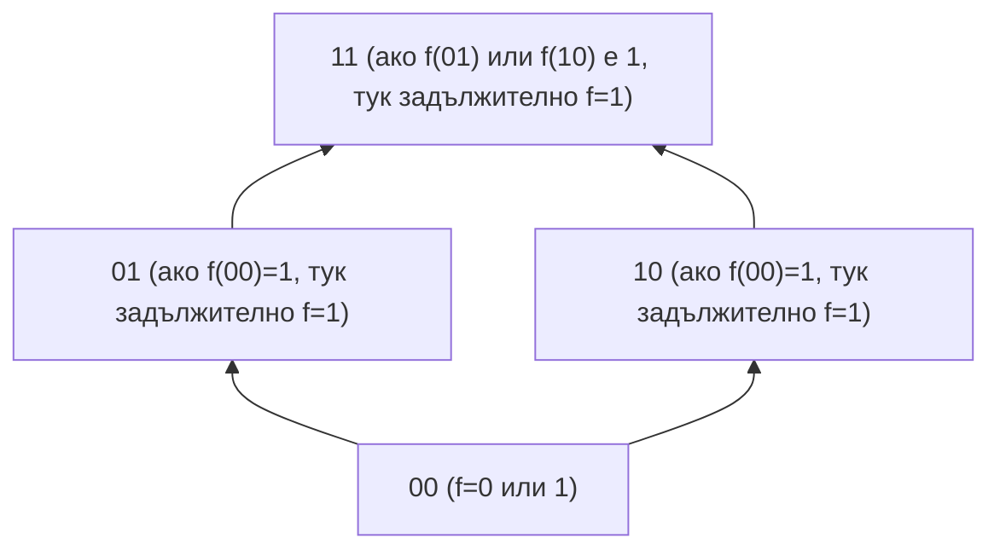

# 6. Булеви функции

## 1. Дефиниция
- **Дискретна функция** - n-местна дискретна функция е всяко изображение от n-тата декартова степен на крайно множество $A$ към самото множество $A$.

  - Нека $|A| = m, n \in \mathbb{N}$
  - $f$ е дискретна функция $\iff f: A^n \to A$
  - Броят на всички $n$-местни дискретни функции в $A$ е: $m^{m^n}$

- **Булевите функции** са частен случай на дискретните функции, при които множеството $A$ е $\{0, 1\}$. Елементите на $\{0, 1\}^n$ се наричат булеви вектори.

  - $F_2^n = \{ f \mid f: \{0, 1\}^n \to \{0, 1\} \}$
  - $F_2 = \bigcup_{n=1}^{\infty} F_2^n$

- **Фиктивна променлива** е тази, от която НЕ зависи стойността на функцията
  - $ \forall x_1, \dots, x_{i-1}, x_{i+1}, \dots, x_n \in \{0, 1\}:$
  $f(x_1, \dots, 0, \dots, x_n) = f(x_1, \dots, 1, \dots, x_n)$

- **Съществена променлива** е тази, от която зависи стойността на функцията
  - $ \forall x_1, \dots, x_{i-1}, x_{i+1}, \dots, x_n \in \{0, 1\}:$
  $f(x_1, \dots, 0, \dots, x_n) \not= f(x_1, \dots, 1, \dots, x_n)$

- **Проектираща функция** е такава, която директно връща k-тия си аргумент
  - $I^n_k : \{0, 1\}^n \to \{0, 1\}$ е проектираща
  - $\forall (x_1, x_2, \dots, x_n) \in \{0, 1\}^n : I^n_k(x_1, x_2, \dots, x_n) = x_k$

- **Лексикографска наредба** - стандартна подредба на булевите вектори, съответстваща на тяхното двоично представяне като числа.

  - **Индуктивна дефиниция:**
    1. $n=1: (0, 1)$
    2. $n+1: (0\alpha_0, 0\alpha_1, \dots, 0\alpha_{2^n-1}, 1\alpha_0, 1\alpha_1, \dots, 1\alpha_{2^n-1})$

  - **Позиция на вектор:**
    - Векторът $a_{n-1}a_{n-2} \dots a_0$ се намира на позиция:
$$\sum_{i=0}^{n-1} a_i \cdot 2^i$$

## 2. Функции на една променлива (n=1)
| име | запис | функция | 0 | 1 |
|---|---|---|---|---|
| константна нула | **0** | $f(x)=0$ | 0 | 0 |
| идентитет | id | $f(x)=x$ | 0 | 1 |
| отрицание | not | $f(x)=x+1$ | 1 | 0 |
| константна единица | **1** | $f(x)=1$ | 1 | 1 |

## 3. Функции на две променливи (n=2)
| име | запис | функция | 00 | 01 | 10 | 11 |
|---|---|---|---|---|---|---|
| константна нула | **0** | $f(x)=0$ | 0 | 0 | 0 | 0 |
| константна единица | **1** | $f(x)=1$ | 1 | 1 | 1 | 1 |
| сума / $xor$ | $\oplus$ | $f(x,y)=x+y$ | 0 | 1 | 1 | 0 |
| еквиваленция | $\equiv$ | $f(x,y)=x+y+1$ | 1 | 0 | 0 | 1 |
| черта на Шефер | \| | $f(x,y)=xy+1$ | 0 | 0 | 0 | 1 |
| конюнкция / $and$ | $\land$ | $f(x,y)=xy+1$ | 1 | 1 | 1 | 0 |
| стрелка на Пиърс | $\downarrow$ | $f(x,y)=1+x+y+xy$ | 1 | 0 | 0 | 0 |
| дизюнкция / $or$ | $\lor$ | $f(x,y)=x+y+xy$ | 0 | 1 | 1 | 1 |
| импликация | $\Rightarrow$ | $f(x,y)=1+x+xy$ | 1 | 1 | 0 | 1 |
| проектираща $x_1$ | $I_1^2$ | $f(x,y)=x$ | 0 | 0 | 1 | 1 |
| проектираща $x_2$ | $I_2^2$ | $f(x,y)=y$ | 0 | 1 | 0 | 1 |

## 4. Закони на Булевата алгебра

1. **Комутативност:** $x \lor y = y \lor x$
2. **Асоциативност:** $(x \oplus y) \oplus z = x \oplus (y \oplus z)$
3. **Дистрибутивност:** $x(y \lor z) = xy \lor xz$
4. **Идемпотентност:** $xx = x, x \lor x = x$
5. **Де Морган:** $\overline{xy} = \bar{x} \lor \bar{y}$ и $\overline{x \lor y} = \bar{x}\bar{y}$

## 5. Суперпозиция и Затваряне

- **Суперпозиция** -  операция, при която една функция се "влага" като аргумент в друга функция.
  - $h(x_1, \dots, x_n) = f(g_1(x_1, \dots, x_n), \dots, g_k(x_1, \dots, x_n))$

- **Затваряне $[F]$** - най-малкото множество от функции, което съдържа $F$ и всички проекции, и е затворено спрямо операцията суперпозиция.
  1. $F \subseteq [F]$
  2. $F \subseteq G \implies [F] \subseteq [G]$
  3. $[[F]] = [F]$ (Идемпотентност на затварянето)

## 6. Пълни множества от булеви функции

- **Пълнота** - свойство на множество от функции, което позволява чрез тях да се изрази всяка възможна булева функция чрез суперпозиция.
    - $[F] = F_2$

- **Степенен запис** - кратък запис за променлива или нейното отрицание, който съвпада с операцията еквивалентност $x \leftrightarrow a$.
    - $x^a = \begin{cases} \bar{x}, & a = 0 \\ x, & a = 1 \end{cases} \implies b^a = 1 \iff b = a$

- **Лема** - конюнкция на крайни на брой различни променливи или техните отрицания.
    - $b_{1}^{a_1} b_{2}^{a_2} \dots b_{k}^{a_k}=1 \iff b_1=a_1 \land b_2=a_2 \dots b_k=a_k$

- **Разлагане на функция** - представяне на произволна булева функция чрез фиксиране на част от нейните променливи.
    - $f(x_1, \dots, x_n) = \bigvee_{a_1, \dots, a_i \in \{0,1\}} x_1^{a_1} \dots x_i^{a_i} \cdot f(a_1, \dots, a_i, x_{i+1}, \dots, x_n)$

- **Теорема на Бул** - твърдение, че всяка булева функция може да се представи чрез отрицание, конюнкция и дизюнкция.
    - $\{\bar{x}, xy, x \lor y\}$ е пълно множество $\implies [\{\bar{x}, xy, x \lor y\}] = F_2$

## 7. Полином на Жегалкин

- **Полином на Жегалкин** - представяне на булева функция като сума по модул 2 ($\oplus$) от конюнкции на различни променливи.
    - $P(x_1, \dots, x_n) = \bigoplus_{I \subseteq \{1,\dots,n\}} a_I \left( \prod_{i \in I} x_i \right)$

  - Всяка булева функция притежава **уникално** представяне под формата на полином на Жегалкин.
    - $\forall f \in F_2^n, \exists! P: P \equiv f$

## 8. Съвършени форми

- **СКНФ (Съвършена конюнктивна нормална форма)** - представяне на функция $f \neq e_1$ като конюнкция от елементарни дизюнкции, съответстващи на нулевите стойности на функцията.
    - $f(x_1, \dots, x_n) = \bigwedge_{f(b_1, \dots, b_n)=0} (x_1^{b_1} \lor x_2^{b_2} \lor \dots \lor x_n^{b_n})$
- **СДНФ (Съвършена дизюнктивна нормална форма)** - представяне на функция $f \neq e_0$ като дизюнкция от елементарни конюнкции, съответстващи на единичните стойности на функцията.
    - $f(x_1, \dots, x_n) = \bigvee_{f(a_1, \dots, a_n)=1} x_1^{a_1} x_2^{a_2} \dots x_n^{a_n}$

## Пример за представяне на Булеви функции

Да разгледаме функцията $f(x, y, z)$, която приема стойност **1** само в следните три точки от таблицата за истинност: $(0, 0, 1)$ $(0, 1, 1)$ $(1, 1, 1)$

* Съвършена Дизюнктивна Нормална Форма (СДНФ)
При СДНФ описваме точките, в които функцията е **единица**. Всяка точка съответства на конюнкция (минтерм).
  - $(0, 0, 1) \implies \bar{x}\bar{y}z$
  - $(0, 1, 1) \implies \bar{x}yz$
  - $(1, 1, 1) \implies xyz$

  * **Формула:** $f(x, y, z) = (\bar{x}\bar{y}z) \vee (\bar{x}yz) \vee (xyz)$

* Съвършена Конюнктивна Нормална Форма (СКНФ)
При СКНФ описваме точките, в които функцията е **нула**. Това са всички останали комбинации: $(0,0,0), (0,1,0), (1,0,0), (1,0,1), (1,1,0)$.

  - $(0, 0, 0) \implies (x \vee y \vee z)$
  - $(0, 1, 0) \implies (x \vee \bar{y} \vee z)$
  - $(1, 0, 0) \implies (\bar{x} \vee y \vee z)$
  - $(1, 0, 1) \implies (\bar{x} \vee y \vee \bar{z})$
  - $(1, 1, 0) \implies (\bar{x} \vee \bar{y} \vee z)$

  * **Формула:** $f(x, y, z) = (x \vee y \vee z)(x \vee \bar{y} \vee z)(\bar{x} \vee y \vee z)(\bar{x} \vee y \vee \bar{z})(\bar{x} \vee \bar{y} \vee z)$

---

## 3. Полином на Жегалкин
За преминаване към езика на Жегалкин използваме СДНФ, като заменяме дизюнкцията ($\vee$) със сума по модул 2 ($\oplus$), а отрицанието ($\bar{a}$) с $(a \oplus 1)$.

**Първоначален израз:**
$$f(x, y, z) = ((x \oplus 1)(y \oplus 1)z) \oplus ((x \oplus 1)yz) \oplus (xyz)$$

**Разкриване на скобите:**
1. $(x \oplus 1)(y \oplus 1)z = (xy \oplus x \oplus y \oplus 1)z = xyz \oplus xz \oplus yz \oplus z$
2. $(x \oplus 1)yz = xyz \oplus yz$
3. $xyz$

**Опростяване чрез съкращаване на двойки ($a \oplus a = 0$):**
$$f = (xyz \oplus xz \oplus yz \oplus z) \oplus (xyz \oplus yz) \oplus xyz$$
$$f = xyz \oplus xz \oplus z$$

**Краен полином:**
$$f(x, y, z) = xyz \oplus xz \oplus z$$

---

## Сравнителна таблица

| Форма | Гледаме стойност | Операции |
| :--- | :--- | :--- |
| **СДНФ** | $f = 1$ | Дизюнкция на конюнкции |
| **СКНФ** | $f = 0$ | Конюнкция на дизюнкции |
| **Жегалкин** | Всички | Сума по модул 2 и Конюнкция |

## 9. Затворени множества

- **Затворено множество** - множество от функции, което съдържа всички функции, които могат да бъдат получени от него чрез суперпозиция.
    - $[F] = F$
    - **Критерий за затвореност**
      1. $\{I_k^n\} \subseteq F $
      2. $\forall f, g_1, \dots, g_k \in F \implies f(g_1, \dots, g_k) \in F$

- **Запазващи нулата/единицата** - класове функции, които върху изцяло нулеви (или единични) входни вектори дават съответната константа.
    - $T_0 = \{f \mid f(0, \dots, 0) = 0\}$
    - $T_1 = \{f \mid f(1, \dots, 1) = 1\}$

## 10. (Само)двойнствени функции

- **Двойнствена функция** - функция $f^\star$, чиито стойности са инвертирани спрямо $f$ върху противоположните вектори.
    - $f^\star(x_1, \dots, x_n) = \overline{f(\bar{x}_1, \dots, \bar{x}_n)}$

- **Принцип за двойнственост** - операцията за намиране на двойнствена функция е дистрибутивна спрямо суперпозицията.
    - $h = f(g_1, \dots, g_k) \implies h^\star = f^\star(g_1^\star, \dots, g_k^\star)$

- **Самодвойнственост** - свойство на функция, при което тя съвпада със своята двойнствена функция.
    - $f \in S \iff f = f^\star \iff f(x_1, \dots, x_n) = \overline{f(\bar{x}_1, \dots, \bar{x}_n)}$

    - $f \in S \iff \forall \alpha \in \{0, 1\}^n: f(\alpha) \neq f(\bar{\alpha})$

- **Брой на самодвойнствените функции** - броят им се определя от свободата за избор на стойности само върху едната половина от вектора на функцията.
    - $|S_n| = 2^{2^{n-1}}$

## 11. Монотонни булеви функции

- **Монотонност** - функция, при която увеличаването на стойностите на входните аргументи (в смисъла на релацията ≼) никога не води до намаляване на стойността на функцията.
    - $f \in M \iff (\alpha \preceq \beta \implies f(\alpha) \le f(\beta))$

## 12. Линейни булеви функции

- **Линейност** - свойство на функция, чийто полином на Жегалкин не съдържа конюнкции на две или повече променливи (степента му е най-много 1).
  - $f \in L \iff f(x) = a_0 \oplus a_1x_1 \oplus \dots \oplus a_nx_n$

- **Брой на линейните функции** - броят на тези функции зависи само от броя на променливите плюс една свободна константа.
  - $|L_n| = 2^{n+1}$

## 13. Пълнота и Шеферови функции

- **Теорема на Пост-Яблонски** - едно множество е пълно тогава и само тогава, когато не се съдържа изцяло в нито едно от петте затворени класа
  - $F \text{ е пълно} \iff F \not\subseteq T_0, F \not\subseteq T_1, F \not\subseteq S, F \not\subseteq M, F \not\subseteq L$

- **Шеферова функция** - функция, която сама по себе си образува пълно множество (базис от един елемент).
  - $\{f\} \text{ е пълно} \iff [f] = F_2$

  - **Критерий за Шеферовост** - съкратен критерий за проверка
    - $f \text{ е Шеферова} \iff f \notin T_0 \cup T_1 \cup S$

- **Базис** - минимално пълно множество от функции, от което не може да се премахне нито един елемент, без да се загуби свойството пълнота.
    - $F \text{ е базис} \iff ([F]=F_2 \land \forall f \in F: [F \setminus \{f\}] \neq F_2)$
